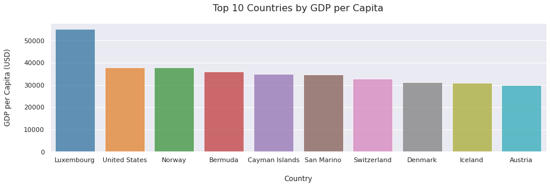
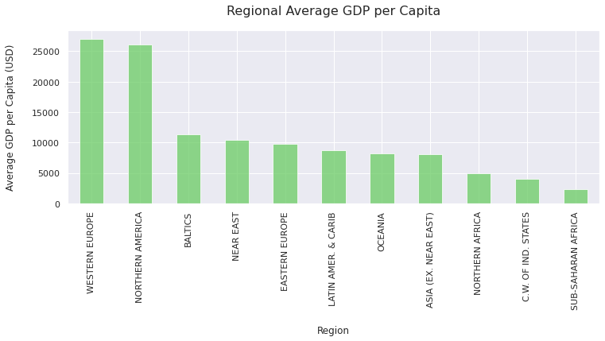
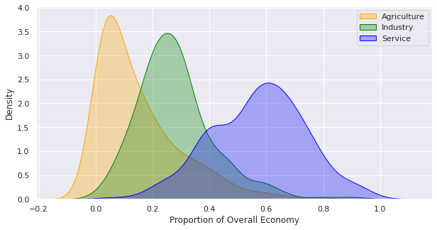
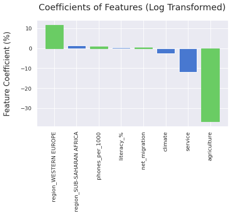
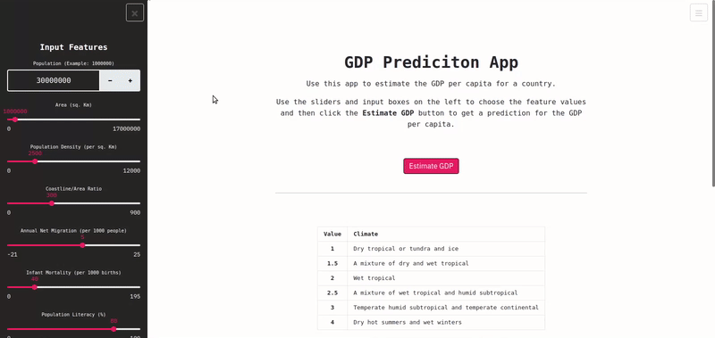

# Countries of the World

## Overview 
In this analysis, I explored a dataset consisting of 227 countries and 20 features. I explored interesting correlations, patterns and trends within the data and then built a model that was able to predict GDP per capita based upon the other features. Finally, I created an interactive web app that allows users to adjust the input parameters before estimating the GDP per capita.

[**Click here to view the notebook in nbviewer**](https://nbviewer.jupyter.org/github/dan-grant-hunter/Countries_of_the_World/blob/main/countries_of_the_world.ipynb)
 
## Summary of Findings
* **phones_per_1000** appeared to have a strong positive correlation with **gdp_per_capita_usd**.

* **agriculture** appeared to be negatively correlated with **gdp_per_capita_usd**.

* The **agriculture** sector made up the smallest proportion **(10% or less)** of most countries' economies, whereas the **service** sector made up a much larger proportion **(40–80%)**.

* **Luxembourg** had a considerably **higher GDP per capita** than all other countries, even amongst other countries within the top 10 highest GDP per capita.

## Summary Statistics of Models

With GDP per capita ranging between $500 and $55,100, the best model for predicting GDP per capita was the Gradient Boosting model with an RMSE of $2389.22. The Random Forest model scored similarly with an RMSE of $2413.10. The worst model was the Support Vector Regressor with an RMSE of $4030.28.

| Models | Best MAE | Best RMSE | Best R² | Data Split Used |
| :- | :-: | :-: | :-: | :- |
| Linear Regression | 2317.30 | 3129.05 | 0.88 | Selected Features, Log Transformed |
| Ridge Regression (L2) | 2557.40 | 3187.32 | 0.88 | All Features, with Scaling |
| Lasso Regression (L1) | 2692.61 | 3490.58 | 0.85 | All Features, with Scaling |
| Support Vector Regression | 2880.74 | 4030.28 | 0.80 | Selected Features, Log Transformed |
| Random Forest | 1708.67 | 2413.10 | 0.93 | All Features, No Scaling |
| **Gradient Boosting** | **1561.26** | **2389.22** | **0.93** | **Selected Features, No Scaling** |

## Code and Resources Used 
**Python Version:** 3.8.5  
**Packages:** pandas, numpy, matplotlib, seaborn, scikit-learn, statsmodels, yellowbrick, pickle, streamlit 

## About the Data

The dataset used in this analysis was taken from Kaggle courtesy of Fernando Lasso. However, the data is sourced originally from the CIA World Factbook which provides information on the history, people and society, government, economy, energy, geography, communications, transportation, military, and transnational issues for world entities.

For the dataset used in this analysis, visit: https://www.kaggle.com/fernandol/countries-of-the-world

For more information on the CIA World Factbook, visit: https://www.cia.gov/library/publications/the-world-factbook/ 

## EDA

Below are a few highlights from the analysis. 
  
  
  
 
  
 

## Feature Importance

We analysed feature importance and found that agriculture appeared to be the most important feature followed by region_WESTERN EUROPE.

## Model Deployment

After training all of our models, I pickled the best model which used all of the features (Random Forest). I then used Streamlit to create an interactive web app which allows users to adjust the input parameters and predict GDP per capita using the trained Random Forest model. Finally, I deployed the app using Heroku. 

[**Click here to use the app**](https://gdp-predictor-app.herokuapp.com/)

## Future Recommendations

If we had more time and computational resources, we could potentially improve our results even further by exploring other models and also experimenting with different hyperparameters.

We could also investigate more of the correlations to gain a better understanding of their relationship. For example, phones_per_1000 had a strong positive correlation with GDP per capita but it wasn't clear why.

Finally, as this dataset is somewhat outdated, it would be interesting to do a similar analysis on the most recent data. We could then compare the results to explore differences, similarities and trends.
